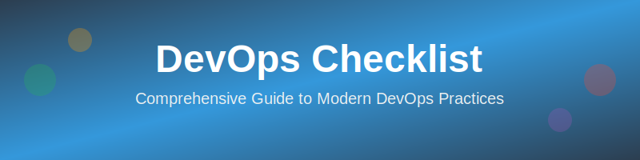

<p align="center">

</p>

## 🎯 Repository Purpose

Provide teams, organizations, and aspiring DevOps engineers a **comprehensive, modern guide** on DevOps best practices, tools, and workflows to build, secure, and deploy applications efficiently.

**Note**: These checklists are **opinionated** and based on industry experience with modern DevOps practices and DORA principles. They represent common patterns but are not universal truth. You should adapt them to your specific needs and context. Contributions, discussions, and improvements are more than welcome!

🚧 This repository is continuously evolving with DevOps best practices. Contributions and real-world insights are encouraged!

---

## 📋 How to Use This Checklist

This is an **aspirational DevOps maturity checklist** designed to help teams assess and improve their practices. Think of it as a scorecard for your DevOps journey.

### 🎯 For Teams

**Mark each item based on your current state:**
- ✅ **Achieved** - Fully implemented and working well
- 🔄 **In Progress** - Partially implemented or being worked on
- ⏳ **Not Yet** - Not started or planned for future
- ❌ **Not Applicable** - Doesn't fit your context

**Using the checklist:**
1. **Assess**: Go through sections relevant to your team and mark current state
2. **Prioritize**: Identify high-impact items to work on next (focus on ⚠️ REQUIRED and ⭐ PREFERRED items first)
3. **Track**: Revisit quarterly to measure progress
4. **Adapt**: Not everything applies to every organization - skip what doesn't make sense for you

### 📊 Maturity Scoring

Calculate your DevOps maturity score per section:
- **Score = (Achieved items / Total applicable items) × 100**
- **0-30%**: Beginning - Focus on foundations (Git, CI/CD basics, basic monitoring)
- **31-60%**: Developing - Expand capabilities (security scanning, IaC, advanced monitoring)
- **61-85%**: Mature - Optimize and scale (GitOps, service mesh, FinOps, policy as code)
- **86-100%**: Leading - Innovation and continuous improvement

### 👤 For Individuals

Use this as a **learning roadmap** and **career development guide**:
- Check off items as you learn and gain hands-on experience
- Focus on one section at a time (see the [3-month roadmap](SETUP_GUIDE.md))
- Build portfolio projects demonstrating key practices
- Track your progress toward DevOps engineer roles

### 💡 Pro Tips

- **Start small**: Don't try to implement everything at once
- **Quick wins first**: Tackle items that provide immediate value with low effort
- **Document decisions**: Record why you chose certain tools or skipped certain practices
- **Share and collaborate**: Use this checklist in team discussions and planning sessions

---

<!-- 
Suggested GitHub Topics for this repository:
devops, checklist, best-practices, ci-cd, sre, kubernetes, docker, terraform, 
aws, cloud-native, devsecops, gitops, observability, finops, platform-engineering
-->

<center>
<table>
  <tr>
    <td align="center"><a href="#team"><br /><b>Team</b></a></td>
    <td align="center"><a href="#git"><br /><b>Git</b></a></td>
    <td align="center"><a href="#cicd-tooling"><br /><b>CI/CD</b></a></td>
    <td align="center"><a href="#docker"><br /><b>Docker</b></a></td>
    <td align="center"><a href="#sonarqube"><br /><b>SonarQube</b></a></td>
  </tr>
  <tr>
    <td align="center"><a href="#application-security"><br /><b>Security</b></a></td>
    <td align="center"><a href="#terraform"><br /><b>Terraform</b></a></td>
    <td align="center"><a href="#aws"><br /><b>AWS</b></a></td>
    <td align="center"><a href="#kubernetes-orchestration"><br /><b>Kubernetes</b></a></td>
    <td align="center"><a href="#observability-the-mlt-stack"><br /><b>Observability</b></a></td>
  </tr>
  <tr>
    <td align="center"><a href="#governance--policy-as-code"><br /><b>Governance</b></a></td>
    <td align="center"><a href="#finops--cloud-cost-optimization"><br /><b>FinOps</b></a></td>
  </tr>
</table>
</center>
---

## Table of Contents

- [Team 👥](#team-)
  - [Responsibilities](#responsibilities)
  - [Skills](#skills)
  - [DevOps Culture](#devops-culture)
  - [Team Goals (DORA & SLOs)](#team-goals-dora--slos)
  - [For Aspiring DevOps Engineers](#for-aspiring-devops-engineers)
- [Production & Deployment](#production--deployment)
  - [CI/CD Strategy](#cicd-strategy)
  - [Deployment Models](#deployment-models)
  - [Release Management](#release-management)
- [Version Control - Git](#version-control---git)
  - [Repository Structure](#repository-structure)
  - [Branching Strategy](#branching-strategy)
  - [Git Workflow](#git-workflow)
  - [Security & Access](#security--access)
- [CI/CD Tooling](#cicd-tooling)
  - [Jenkins Setup](#jenkins-setup)
  - [Pipeline Best Practices](#pipeline-best-practices)
  - [Pipeline as Code (Jenkinsfile Example)](#pipeline-as-code-jenkinsfile-example)
  - [Modern CI/CD Alternatives](#modern-cicd-alternatives)
  - [Security & Credentials](#security--credentials)
  - [Plugins & Integrations](#plugins--integrations)
- [Code Quality - SonarQube](#code-quality---sonarqube)
  - [Setup & Configuration](#setup--configuration)
  - [Quality Gates](#quality-gates)
  - [Integration with CI/CD](#integration-with-cicd)
- [Containerization - Docker](#containerization---docker)
  - [Image Best Practices](#image-best-practices)
  - [Dockerfile Guidelines](#dockerfile-guidelines)
  - [Container Security](#container-security)
  - [Registry Management](#registry-management)
- [Artifact Management](#artifact-management)
  - [Nexus Repository](#nexus-repository)
  - [JFrog Artifactory](#jfrog-artifactory)
  - [Cloud-Native Registries (ECR/ACR/GCR)](#cloud-native-registries-ecracrgcr)
  - [Artifact Lifecycle](#artifact-lifecycle)
  - [Security & Access Control](#security--access-control-1)
- [Application Security (DevSecOps)](#application-security-devsecops)
  - [SAST - Static Application Security Testing](#sast---static-application-security-testing)
  - [SCA - Software Composition Analysis](#sca---software-composition-analysis)
  - [DAST - Dynamic Application Security Testing](#dast---dynamic-application-security-testing)
  - [Security in CI/CD (Shift-Left)](#security-in-cicd-shift-left)
  - [Vulnerability Management](#vulnerability-management)
- [Infrastructure as Code - Terraform](#infrastructure-as-code---terraform)
  - [Project Structure](#project-structure)
  - [Best Practices](#best-practices)
  - [State Management](#state-management)
  - [Modules & Reusability](#modules--reusability)
- [Cloud Platform - AWS](#cloud-platform---aws)
  - [Account Structure](#account-structure)
  - [Core Services](#core-services)
  - [Security & IAM](#security--iam)
  - [Cost Optimization](#cost-optimization)
  - [Networking](#networking)
- [Container Orchestration (ECS & Kubernetes/EKS)](#container-orchestration-ecs--kuberneteseks)
  - [Orchestrator Decision (ECS vs EKS)](#orchestrator-decision-ecs-vs-eks)
  - [AWS ECS Task Definitions](#aws-ecs-task-definitions)
  - [AWS ECS Service Configuration](#aws-ecs-service-configuration)
  - [Kubernetes/EKS Fundamentals](#kuberneteseks-fundamentals)
  - [Deployment Strategies](#deployment-strategies)
- [Kubernetes Orchestration](#kubernetes-orchestration)
  - [Cluster Management (EKS/GKE/AKS)](#cluster-management-eksgkeaks)
  - [Package Management (Helm & Kustomize)](#package-management-helm--kustomize)
  - [RBAC & Security](#rbac--security)
  - [Service Mesh (Istio/Linkerd)](#service-mesh-istiolinkerd)
  - [Autoscaling & Resource Management](#autoscaling--resource-management)
  - [GitOps with ArgoCD/Flux](#gitops-with-argocdflux)
- [Observability (The MLT Stack)](#observability-the-mlt-stack)
  - [Metrics (Prometheus & Grafana)](#metrics-prometheus--grafana)
  - [Logging (ELK Stack & Loki)](#logging-elk-stack--loki)
  - [Tracing (OpenTelemetry & Jaeger)](#tracing-opentelemetry--jaeger)
  - [Unified Observability Platform](#unified-observability-platform)
  - [Alerting & SLOs](#alerting--slos)
- [Governance & Policy as Code](#governance--policy-as-code)
  - [Open Policy Agent (OPA)](#open-policy-agent-opa)
  - [HashiCorp Sentinel](#hashicorp-sentinel)
  - [Cloud Compliance (AWS Config/Azure Policy)](#cloud-compliance-aws-configazure-policy)
  - [Policy Enforcement in CI/CD](#policy-enforcement-in-cicd)
  - [Audit & Compliance Reporting](#audit--compliance-reporting)
- [FinOps & Cloud Cost Optimization](#finops--cloud-cost-optimization)
  - [Cost Visibility & Tagging Strategy](#cost-visibility--tagging-strategy)
  - [Budget Management & Alerts](#budget-management--alerts)
  - [Resource Right-Sizing](#resource-right-sizing)
  - [Reserved Instances & Savings Plans](#reserved-instances--savings-plans)
  - [Cost Governance & Accountability](#cost-governance--accountability)
- [Monitoring & Observability (The Three Pillars)](#monitoring--observability-the-three-pillars)
  - [Three Pillars of Observability](#three-pillars-of-observability)
  - [Dashboards & Visualization (Grafana/CloudWatch)](#dashboards--visualization-grafanacloudwatch)
  - [Alerting & Incident Response](#alerting--incident-response)
- [Continuous Improvement](#continuous-improvement)
- [Getting Started Guide](#getting-started-guide)
- [Resources](#resources)
- [Contributing](#contributing)
- [Credits](#credits)
- [License](#license)

---

## Team 👥

### Responsibilities

- [ ] **Define Clear DevOps Responsibilities**
  - Core Responsibilities:
    - [ ] CI/CD pipeline development and maintenance
    - [ ] Infrastructure automation
    - [ ] Deployment orchestration
    - [ ] Monitoring and alerting setup
    - [ ] Security integration (DevSecOps)
    - [ ] Toolchain management
  - Collaborative Responsibilities:
    - [ ] Working with developers on deployment strategies
    - [ ] Collaborating with security teams on compliance
    - [ ] Supporting operations with infrastructure

- [ ] **Document Everything**
  - [ ] Team responsibilities clearly written
  - [ ] Runbooks for common operations
  - [ ] Incident response procedures
  - [ ] Onboarding documentation
  - [ ] Tool usage guides

### Skills

#### Must-Have Skills

- [ ] **Version Control (Git)**
  - [ ] Understanding of Git workflows (GitFlow, trunk-based)
  - [ ] Branching strategies and merge strategies
  - [ ] Git hooks and automation

- [ ] **CI/CD Fundamentals**
  - [ ] Pipeline design and implementation
  - [ ] Build automation
  - [ ] Deployment automation
  - [ ] Testing integration

- [ ] **Scripting & Automation**
  - [ ] Shell scripting (Bash/Zsh)
  - [ ] Python or another scripting language
  - [ ] Configuration management basics

- [ ] **Containerization**
  - [ ] Docker fundamentals
  - [ ] Container orchestration concepts
  - [ ] Image optimization

- [ ] **Cloud Platform Knowledge**
  - [ ] At least one cloud platform (AWS, Azure, GCP)
  - [ ] IaaS, PaaS, SaaS concepts
  - [ ] Cloud services for compute, storage, networking

- [ ] **Infrastructure as Code**
  - [ ] **Terraform**, CloudFormation, or similar
  - [ ] Configuration management (Ansible, Chef, Puppet)
  - [ ] Version control for infrastructure

- [ ] **Security Awareness**
  - [ ] Secure coding practices
  - [ ] Secrets management
  - [ ] Vulnerability scanning
  - [ ] Compliance basics (SOC2, HIPAA, etc.)

#### Good-to-Have Skills

- [ ] Programming languages (Go, Python, Java)
- [ ] **Kubernetes/EKS** for container orchestration
- [ ] Advanced networking concepts
- [ ] Database administration basics
- [ ] **Prometheus** and **Grafana** for monitoring and observability

### DevOps Culture

- [ ] **Break Down Silos**
  - [ ] Development and Operations work together
  - [ ] Shared responsibility for production
  - [ ] Cross-functional collaboration

- [ ] **Automation First Mindset**
  - [ ] Automate repetitive tasks
  - [ ] Infrastructure as Code everywhere
  - [ ] Self-service capabilities for developers

- [ ] **Continuous Improvement**
  - [ ] Regular retrospectives
  - [ ] Postmortem culture (blameless)
  - [ ] Metrics-driven improvements

- [ ] **Shift-Left Approach**
  - [ ] Security integrated early (DevSecOps)
  - [ ] Testing early in the pipeline
  - [ ] Quality checks from the start

### Team Goals (DORA & SLOs)

- [ ] **Define DORA Metrics (The Four Keys)**
  - [ ] **Deployment frequency** (How often you ship)
  - [ ] **Lead time for changes** (Time from commit to production)
  - [ ] **Mean time to recovery (MTTR)** (How fast you fix failures)
  - [ ] **Change failure rate (%)** (How often deployment fails)

- [ ] **Service Level Objectives (SLOs)**
  - [ ] Define **SLOs** for critical services (e.g., 99.9% uptime)
  - [ ] Define **SLIs** (Service Level Indicators) to measure SLOs (e.g., latency, error rate)
  - [ ] Pipeline execution time targets
  - [ ] Deployment success rates

- [ ] **Team Maturity Model**
  - [ ] Level 1: Manual Deployments - Moving to automation
  - [ ] Level 2: Automated CI/CD - Pipelines established
  - [ ] Level 3: Advanced Automation - Security integrated, monitoring
  - [ ] Level 4: Full DevSecOps - Shift-left, self-service, optimization

### For Aspiring DevOps Engineers

Welcome to DevOps! :wave: This checklist is your roadmap.

#### Learning Path (12 Months)

- [ ] **Month 1-2: Foundations**
  - [ ] Master Git basics (clone, commit, push, pull, branch, merge)
  - [ ] Learn Linux command line fundamentals
  - [ ] Start with Bash/Shell scripting
  - [ ] Understand CI/CD concepts

- [ ] **Month 3-4: CI/CD & Containers**
  - [ ] Set up Jenkins/GitHub Actions locally
  - [ ] Create your first pipeline
  - [ ] Learn Docker basics
  - [ ] Build and run containers
  - [ ] Push images to Docker Hub/ECR

- [ ] **Month 5-6: Cloud & IaC**
  - [ ] Get AWS free tier account
  - [ ] Learn EC2, S3, VPC basics
  - [ ] Start with Terraform
  - [ ] Provision simple infrastructure

- [ ] **Month 7-8: Security & Quality**
  - [ ] Integrate SonarQube in pipeline
  - [ ] Learn about SAST/DAST/SCA tools
  - [ ] Understand secrets management
  - [ ] Practice secure coding

- [ ] **Month 9-12: Advanced Topics**
  - [ ] Container orchestration (**ECS/Kubernetes**)
  - [ ] Advanced AWS services
  - [ ] Monitoring and logging (**Prometheus/Grafana**)
  - [ ] Build complete end-to-end projects

#### Portfolio Projects

Build these to showcase your skills:

- [ ] **Project 1: Simple CI/CD Pipeline**
  - [ ] Git repo → GitHub Actions/Jenkins → Build → Test → Deploy to server

- [ ] **Project 2: Dockerized Application**
  - [ ] Multi-container app with Docker Compose
  - [ ] Published to registry

- [ ] **Project 3: AWS Infrastructure with Terraform**
  - [ ] VPC, EC2, RDS provisioned with IaC
  - [ ] Documented and in version control

- [ ] **Project 4: Complete DevSecOps Pipeline**
  - [ ] Git → CI Tool → SonarQube/SAST → SCA → Docker Build → DAST → Deploy to ECS/EKS
  - [ ] Security scans integrated
  - [ ] Monitoring and alerts set up

#### Career Development

- [ ] **Resume & Portfolio**
  - [ ] GitHub profile with projects
  - [ ] LinkedIn profile optimized
  - [ ] Personal blog/documentation
  - [ ] Certifications (AWS, Docker, etc.)

- [ ] **Networking**
  - [ ] Join DevOps communities
  - [ ] Contribute to open source
  - [ ] Attend meetups/conferences
  - [ ] Follow industry leaders

---

## Production & Deployment

### CI/CD Strategy

- [ ] **Define Deployment Strategy**
  - [ ] What triggers deployments? (commits, tags, manual)
  - [ ] How often do you deploy? (continuous, daily, weekly)
  - [ ] Who can trigger production deployments?

- [ ] **Environments**
  - [ ] Development environment
  - [ ] Testing/QA environment
  - [ ] Staging environment (production-like)
  - [ ] Production environment
  - [ ] **Environment parity**: Staging closely mirrors production
    - [ ] Same infrastructure configuration (IaC applied to all)
    - [ ] Same resource sizes and scaling rules
    - [ ] Same network topology
    - [ ] Same security policies
    - [ ] Same monitoring and logging setup
  - [ ] Proper isolation between environments (separate AWS accounts/VPCs)
  - [ ] **Ephemeral test environments** for feature branches (optional but recommended)
    - [ ] Automatically provisioned per PR
    - [ ] Automatically destroyed after merge/close
    - [ ] Cost-effective testing of infrastructure changes

- [ ] **Immutable Artifacts & Promotion**
  - [ ] Build once, deploy many times (same artifact across environments)
  - [ ] Artifacts stored in registry (Docker images, JARs, etc.)
  - [ ] **No rebuilding for different environments** (use config injection)
  - [ ] Artifact versioning and traceability
  - [ ] Promotion workflow: Dev → QA → Staging → Prod
  - [ ] Artifact scanning before promotion

- [ ] **Pipeline Stages**
  - [ ] Source code checkout
  - [ ] Build & compile
  - [ ] Unit tests
  - [ ] Code quality checks (**SonarQube**)
  - [ ] Security scans (**SAST**)
  - [ ] Dependency scanning (**SCA**)
  - [ ] Container image build
  - [ ] Integration tests
  - [ ] Security scans (**DAST**)
  - [ ] Artifact storage (**Nexus**)
  - [ ] Deployment to environments
  - [ ] Post-deployment tests

### Deployment Models

- [ ] **Choose Deployment Strategy**
  - [ ] **Blue-Green Deployment**: Two identical environments; switch traffic between them; easy rollback.
  - [ ] **Canary Deployment**: Gradual rollout to subset of users; monitor metrics before full rollout.
  - [ ] **Rolling Deployment**: Update instances one by one; zero downtime.
  - [ ] Recreate (Not recommended for production)

### Release Management

- [ ] **Versioning Strategy**
  - [ ] **Semantic versioning** (MAJOR.MINOR.PATCH)
  - [ ] Git tags for releases
  - [ ] Changelog maintained

- [ ] **Rollback Capability**
  - [ ] Quick rollback procedure documented
  - [ ] Automated rollback triggers
  - [ ] Database migration rollback strategy

- [ ] **Release Communication**
  - [ ] Release notes published
  - [ ] Stakeholders notified
  - [ ] Deployment windows communicated

---

## Version Control - Git

### Repository Structure

- [ ] **Organization**
  - [ ] Separate repositories for services (microservices approach)
  - [ ] Monorepo vs Multi-repo decision made
  - [ ] Clear naming conventions

- [ ] **Repository Content**
  - [ ] Application source code
  - [ ] Infrastructure as Code files
  - [ ] CI/CD pipeline definitions
  - [ ] Documentation (README, CONTRIBUTING)
  - [ ] `.gitignore` properly configured

- [ ] **Forbidden Content**
  - [ ] **NO secrets**, passwords, API keys
  - [ ] NO large binary files (use Git LFS if needed)
  - [ ] NO compiled artifacts (use artifact repository)

### Branching Strategy

- [ ] **Choose a Strategy**
  - [ ] **GitFlow** (for scheduled releases)
  - [ ] **Trunk-Based Development** (TBD) (for continuous deployment)
  - [ ] **GitHub Flow** (simplified)

- [ ] **Branch Protection**
  - [ ] `main` branch protected
  - [ ] Require pull request reviews
  - [ ] Require status checks to pass
  - [ ] No force push allowed
  - [ ] Require signed commits (optional but recommended)

### Git Workflow

- [ ] **Commit Practices**
  - [ ] Clear, descriptive commit messages
  - [ ] **Conventional commits** (feat:, fix:, docs:, etc.)
  - [ ] Small, atomic commits
  - [ ] No "work in progress" commits in main

- [ ] **Pull Request Process**
  - [ ] Pull request template defined
  - [ ] Code review required (at least 1-2 reviewers)
  - [ ] CI checks must pass
  - [ ] Link to issue/ticket
  - [ ] Description of changes

- [ ] **Git Hooks**
  - [ ] Pre-commit hooks for linting/formatting checks
  - [ ] Pre-commit hooks for **secret scanning**
  - [ ] Pre-push hooks to run local tests

### Security & Access

- [ ] **Access Control**
  - [ ] Least privilege principle
  - [ ] Role-based access (read, write, admin)
  - [ ] Regular access audits

- [ ] **Security Scanning**
  - [ ] Git secrets scanning (detect leaked credentials with tools like **GitLeaks** or **TruffleHog**)
  - [ ] Dependency vulnerability scanning
  - [ ] Automated security alerts

- [ ] **Backup & Disaster Recovery**
  - [ ] Git server/platform backups
  - [ ] Disaster recovery plan documented

---

## CI/CD Tooling

Modern CI/CD prioritizes **automation, security, and maintainability**. While **Jenkins** remains powerful with **Configuration as Code (JCasC)**, cloud-native alternatives like **GitHub Actions** and **GitLab CI** offer reduced operational overhead and tighter integration with modern development workflows.

**🎯 Key Recommendation:** For new projects, prioritize **GitHub Actions** or **GitLab CI** for their simplicity and native cloud integration. Use **Jenkins with JCasC** for complex enterprise environments requiring extensive customization.

### Jenkins Setup (Configuration as Code)

- [ ] **Installation & Configuration**
  - [ ] Jenkins installed (Docker recommended)
  - [ ] **Jenkins Configuration as Code (JCasC)** implemented for reproducible config
  - [ ] JCasC YAML file version-controlled in Git
  - [ ] Master-agent architecture for distributed builds
  - [ ] High availability setup (for production)

- [ ] **JCasC Best Practices**
  - [ ] All Jenkins configuration defined in `jenkins.yaml`
  - [ ] Credentials managed via JCasC with external secret managers
  - [ ] Plugin installation automated via JCasC
  - [ ] No manual UI configuration required
  - [ ] Configuration changes tested in staging first

- [ ] **Backup Strategy**
  - [ ] Jenkins home directory backed up
  - [ ] **JCasC config files in Git** (primary source of truth)
  - [ ] Job definitions stored as code (Jenkinsfile)
  - [ ] Regular automated backup schedule

### Pipeline Best Practices

- [ ] **Pipeline Structure**
  - [ ] **Declarative pipeline** preferred (easier to read)
  - [ ] Stages clearly defined
  - [ ] Parallel execution where possible
  - [ ] Proper error handling

- [ ] **Build Optimization**
  - [ ] Use **Docker agents** for consistent builds
  - [ ] Cache dependencies (Maven, npm, pip)
  - [ ] Incremental builds where possible

- [ ] **Pipeline Stages**
  - [ ] Checkout → Build → Unit Tests → **Code Quality (SonarQube)** → **Security Scan (SAST/SCA)** → Containerize → Publish (**Nexus/Registry**) → Deploy → Verify

### Pipeline as Code (Jenkinsfile Example)

```groovy
pipeline {
    agent {
        docker {
            image 'maven:3.8.1-jdk-11'
        }
    }
    
    environment {
        SONAR_TOKEN = credentials('sonar-token')
        DOCKER_REGISTRY = 'your-registry.com'
    }
    
    stages {
        stage('Checkout') {
            steps {
                checkout scm
            }
        }
        
        stage('Build') {
            steps {
                sh 'mvn clean compile'
            }
        }
        
        stage('Test') {
            steps {
                sh 'mvn test'
            }
            post {
                always {
                    junit 'target/surefire-reports/*.xml'
                }
            }
        }
        
        stage('Code Quality & SAST') {
            steps {
                sh 'mvn sonar:sonar -Dsonar.token=${SONAR_TOKEN}'
                sh 'trivy fs --security-checks vuln .'
            }
        }
        
        stage('Dependency Scan (SCA)') {
            steps {
                sh 'snyk test --json > snyk_report.json' // Example SCA
            }
        }
        
        stage('Package') {
            steps {
                sh 'mvn package -DskipTests'
            }
        }
        
        stage('Docker Build') {
            steps {
                sh 'docker build -t ${DOCKER_REGISTRY}/myapp:${BUILD_NUMBER} .'
            }
        }
        
        stage('Push to Registry') {
            steps {
                sh 'docker push ${DOCKER_REGISTRY}/myapp:${BUILD_NUMBER}'
            }
        }
        
        stage('Deploy to Dev') {
            steps {
                // Deployment steps
                sh './deploy.sh dev ${BUILD_NUMBER}'
            }
        }
    }
    
    post {
        success {
            echo "Build ${BUILD_NUMBER} succeeded" // Replace with slackSend
        }
        failure {
            echo "Build ${BUILD_NUMBER} failed" // Replace with slackSend
        }
        always {
            cleanWs()
        }
    }
}
```

### Modern CI/CD Alternatives (Recommended for Most Teams)

- [ ] **GitHub Actions** ⭐ **PREFERRED for GitHub-hosted projects**
  - [ ] Workflows defined in `.github/workflows/*.yml`
  - [ ] Native integration with GitHub (PRs, Issues, Releases)
  - [ ] Extensive marketplace of pre-built actions
  - [ ] Built-in secrets management
  - [ ] Matrix builds for multi-platform testing
  - [ ] Self-hosted runners for private infrastructure

- [ ] **GitLab CI/CD** ⭐ **PREFERRED for GitLab-hosted projects**
  - [ ] Pipeline defined in `.gitlab-ci.yml`
  - [ ] Integrated with GitLab's full DevOps platform
  - [ ] Auto DevOps for zero-config pipelines
  - [ ] Container registry included
  - [ ] Built-in security scanning (SAST, DAST, dependency scanning)
  - [ ] GitLab Runners (shared or self-hosted)

- [ ] **Modern CI/CD Benefits**
  - [ ] ✅ **No infrastructure to maintain** (managed runners)
  - [ ] ✅ **Native Git platform integration** (better DX)
  - [ ] ✅ **Built-in container support** (Docker, Kubernetes)
  - [ ] ✅ **Simplified YAML syntax** (easier learning curve)
  - [ ] ✅ **Cost-effective** for small to medium teams
  - [ ] ✅ **Cloud-native** by design

**Example GitHub Actions Workflow:**
```yaml
name: CI/CD Pipeline

on:
  push:
    branches: [main, develop]
  pull_request:
    branches: [main]

jobs:
  build-and-test:
    runs-on: ubuntu-latest
    
    steps:
      - uses: actions/checkout@v3
      
      - name: Set up JDK 11
        uses: actions/setup-java@v3
        with:
          java-version: '11'
          distribution: 'temurin'
          cache: maven
      
      - name: Build with Maven
        run: mvn clean compile
      
      - name: Run Tests
        run: mvn test
      
      - name: SonarQube Scan
        uses: sonarsource/sonarqube-scan-action@master
        env:
          SONAR_TOKEN: ${{ secrets.SONAR_TOKEN }}
      
      - name: Trivy Security Scan
        uses: aquasecurity/trivy-action@master
        with:
          scan-type: 'fs'
          scan-ref: '.'
      
      - name: Build Docker Image
        run: docker build -t myapp:${{ github.sha }} .
      
      - name: Push to ECR
        uses: aws-actions/amazon-ecr-login@v1
        # ... push logic
```

### Security & Credentials

  - [ ] **Credentials Management**

      - [ ] Use credentials management systems (Jenkins Credentials, Cloud Secrets Manager, or HashiCorp **Vault**).
      - [ ] **NO hardcoded secrets** in pipeline files.
      - [ ] Rotate credentials regularly.

  - [ ] **Access Control**

      - [ ] Role-based access control (RBAC)
      - [ ] Audit logs enabled

### Plugins & Integrations

  - [ ] **Essential Plugins**
      - [ ] Git, Docker, Pipeline, Credentials, SonarQube Scanner
      - [ ] Slack/Email notifications

-----

## Code Quality - SonarQube

### Setup & Configuration

  - [ ] **Installation**

      - [ ] SonarQube server installed (Docker is common)
      - [ ] Database configured (PostgreSQL recommended)

  - [ ] **Project Setup**

      - [ ] Projects created for each application
      - [ ] Quality profiles defined

### Quality Gates

  - [ ] **Define Quality Gates**

      - [ ] Code coverage threshold (e.g., \> 80%)
      - [ ] Bug and vulnerability limits (zero high/critical)
      - [ ] Code smell limits
      - [ ] Duplication percentage limits

  - [ ] **Enforcement**

      - [ ] Quality gate as pipeline stage
      - [ ] **Block deployment** if quality gate fails
      - [ ] Notify team of failures

### Integration with CI/CD

  - [ ] **PR Analysis**
      - [ ] Pull Request decoration enabled (comments on PRs with issues).
      - [ ] Block merge if quality gate fails.

-----

## Containerization - Docker

### Image Best Practices

  - [ ] **Base Images**

      - [ ] Use official, specific tags, not `latest`.
      - [ ] Use **minimal base images** (Alpine, distroless) for small size and minimal attack surface.
      - [ ] Keep base images updated.

  - [ ] **Image Size**

      - [ ] **Multi-stage builds** for smaller images.
      - [ ] Remove unnecessary files.
      - [ ] Use `.dockerignore` file.

### Dockerfile Guidelines

  - [ ] **Dockerfile Checklist**
      - [ ] Use multi-stage builds.
      - [ ] **Run as non-root user**.
      - [ ] Combine `RUN` commands to reduce layers.
      - [ ] Add health checks.
      - [ ] Use `ENV` for configuration.
      - [ ] Add labels for metadata.

### Container Security

  - [ ] **Security Scanning**

      - [ ] Scan images for vulnerabilities (e.g., **Trivy**, Snyk, Clair).
      - [ ] **Block deployment of vulnerable images**.

  - [ ] **Runtime Security**

      - [ ] Run containers as non-root.
      - [ ] Use **read-only file systems** where possible.
      - [ ] Limit resources (CPU, memory).

  - [ ] **Secrets Management**

      - [ ] NO secrets in images.
      - [ ] Mount secrets at runtime using orchestrator (ECS Secrets, Kubernetes Secrets, Vault).

### Registry Management

  - [ ] **Container Registry**

      - [ ] Choose registry (**ECR**, Docker Hub, GCR, Nexus).
      - [ ] Private registry for internal images.
      - [ ] Access control configured.

  - [ ] **Registry Operations**

      - [ ] Automated image builds.
      - [ ] Image promotion across environments.
      - [ ] Clean up old/unused images.

-----

## Artifact Management

Modern artifact management requires **centralized storage, security, and automation**. While **Nexus** remains popular for self-hosted solutions, **JFrog Artifactory** offers advanced features, and **cloud-native registries** (ECR/ACR/GCR) provide seamless cloud integration.

**🎯 Key Recommendation:** Use **cloud-native registries (ECR/ACR/GCR)** for container images and cloud workloads. For multi-format artifacts (Maven, npm, PyPI, etc.), consider **JFrog Artifactory** or **Nexus** based on your feature requirements.

### Nexus Repository

- [ ] **Repository Setup**
  - [ ] **Hosted**: Your internal artifacts
  - [ ] **Proxy**: Cache external artifacts (Maven Central, npm, etc.)
  - [ ] **Group**: Combine multiple repositories
  - [ ] Support for Maven, npm, Docker, PyPI, NuGet, etc.

- [ ] **Nexus Best Practices**
  - [ ] Repository health checks configured
  - [ ] Blob store strategy defined
  - [ ] Backup and disaster recovery plan
  - [ ] Nexus High Availability for production

### JFrog Artifactory

- [ ] **Advanced Features**
  - [ ] Universal artifact repository (all package types)
  - [ ] **Xray integration** for deep security/license scanning
  - [ ] Advanced replication (multi-site, edge nodes)
  - [ ] **Build integration** with full build metadata tracking
  - [ ] AQL (Artifactory Query Language) for complex searches

- [ ] **Artifactory Configuration**
  - [ ] Local, remote, and virtual repositories configured
  - [ ] Repository layout standards enforced
  - [ ] Cleanup policies automated
  - [ ] Access federation for enterprise SSO

### Cloud-Native Registries (ECR/ACR/GCR)

- [ ] **AWS Elastic Container Registry (ECR)** ⭐ **PREFERRED for AWS workloads**
  - [ ] Private ECR repositories per application/service
  - [ ] **IAM-based access control** (no credential management needed)
  - [ ] Image scanning enabled (vulnerability detection)
  - [ ] Lifecycle policies for automatic cleanup
  - [ ] Cross-region replication configured
  - [ ] Encryption at rest enabled

- [ ] **Azure Container Registry (ACR)** ⭐ **PREFERRED for Azure workloads**
  - [ ] ACR integrated with Azure Active Directory
  - [ ] Geo-replication for global deployments
  - [ ] Content trust and signing enabled
  - [ ] Azure Defender scanning enabled

- [ ] **Google Container Registry (GCR) / Artifact Registry** ⭐ **PREFERRED for GCP workloads**
  - [ ] GCR integrated with GCP IAM
  - [ ] Vulnerability scanning enabled
  - [ ] Binary Authorization for deployment policy
  - [ ] Multi-region storage configured

- [ ] **Cloud Registry Benefits**
  - [ ] ✅ **Zero infrastructure management**
  - [ ] ✅ **Native cloud IAM integration**
  - [ ] ✅ **Built-in vulnerability scanning**
  - [ ] ✅ **Highly available by design**
  - [ ] ✅ **Pay-per-use pricing model**
  - [ ] ✅ **Seamless integration with cloud services** (ECS, EKS, AKS, GKE)

### Artifact Lifecycle

- [ ] **Versioning Strategy**
  - [ ] Snapshot vs Release repositories
  - [ ] Semantic versioning enforced (MAJOR.MINOR.PATCH)
  - [ ] **Immutable releases** (cannot overwrite published artifacts)
  - [ ] Build metadata tracking (commit SHA, build number)

- [ ] **Promotion Strategy**
  - [ ] Automated promotion workflow: Dev → QA → Staging → Prod
  - [ ] Quality gates at each promotion stage
  - [ ] Audit trail for all promotions
  - [ ] Rollback capability maintained

- [ ] **Cleanup Policies**
  - [ ] Automated removal of old snapshots (e.g., >30 days)
  - [ ] Retention policy for releases (e.g., keep last 10 versions)
  - [ ] Unused artifact cleanup based on download activity
  - [ ] Storage quota monitoring and alerts

### Security & Access Control

- [ ] **Authentication**
  - [ ] LDAP/Active Directory/SAML integration
  - [ ] Token-based authentication for CI/CD (no passwords in pipelines)
  - [ ] Multi-factor authentication (MFA) for admin access
  - [ ] API keys rotation policy

- [ ] **Authorization**
  - [ ] Role-based access control (RBAC)
  - [ ] Read/write/delete permissions per repository
  - [ ] Least privilege principle enforced
  - [ ] Regular access audits and reviews

- [ ] **Security Scanning**
  - [ ] Vulnerability scanning on artifact upload
  - [ ] License compliance checking
  - [ ] Malware scanning for binaries
  - [ ] Quarantine mechanism for vulnerable artifacts

-----

## Application Security (DevSecOps)

### SAST - Static Application Security Testing

  - [ ] **SAST Implementation**

      - [ ] SAST integrated in CI/CD pipeline.
      - [ ] Scans run on every commit/PR.
      - [ ] Results block pipeline if critical issues found.

  - [ ] **What SAST Detects**

      - [ ] SQL injection vulnerabilities.
      - [ ] Cross-site scripting (XSS).
      - [ ] Hardcoded secrets/credentials.

### SCA - Software Composition Analysis

  - [ ] **SCA Implementation**
      - [ ] **Dependency Scanning** integrated in CI/CD pipeline (**Snyk, Dependabot, OWASP Dependency-Check**).
      - [ ] Check open-source libraries for known vulnerabilities and license compliance.
      - [ ] Maintain a software bill of materials (SBOM).

### DAST - Dynamic Application Security Testing

  - [ ] **DAST Implementation**

      - [ ] DAST runs in staging/pre-prod environment.
      - [ ] Automated scans after deployment.
      - [ ] **OWASP ZAP** (open-source) is a common tool choice.

  - [ ] **What DAST Detects**

      - [ ] Authentication/authorization flaws.
      - [ ] Configuration errors.
      - [ ] OWASP Top 10 vulnerabilities.

### Security in CI/CD (Shift-Left)

```
1. Code Commit
   ↓
2. SAST Scan (immediate feedback)
   ↓
3. Build & Unit Tests
   ↓
4. Dependency Scan (SCA)
   ↓
5. Container Image Scan (Trivy/Clair)
   ↓
6. Deploy to Staging
   ↓
7. DAST Scan (against running app)
   ↓
8. Deploy to Production
```

  - [ ] **Security Tools Integration**
      - [ ] **Secrets Scanning (MANDATORY)**: 
        - [ ] **GitLeaks** or **TruffleHog** configured to scan **full Git history**
        - [ ] Pre-commit hooks to prevent secret commits
        - [ ] CI/CD pipeline blocks on secret detection
        - [ ] Regular historical scans (weekly/monthly)
        - [ ] Scan all branches, not just main
      - [ ] **License Compliance**: Check license compatibility early

### Secrets Management & Rotation

**🚨 CRITICAL:** Secrets scanning must cover the entire Git history, not just new commits. Historical secrets remain exploitable.

- [ ] **Git History Scanning** ⚠️ **REQUIRED**
  - [ ] **GitLeaks** configured to scan entire repository history
  - [ ] Scan runs on all branches and tags
  - [ ] Custom regex patterns for organization-specific secrets
  - [ ] Baseline exceptions documented for known false positives
  - [ ] Automated scanning in CI/CD on every push

- [ ] **GitLeaks Configuration Example**
  ```toml
  # .gitleaks.toml
  title = "Gitleaks Config"
  
  [[rules]]
  description = "AWS Access Key"
  regex = '''AKIA[0-9A-Z]{16}'''
  tags = ["aws", "credentials"]
  
  [[rules]]
  description = "Private Key"
  regex = '''-----BEGIN (RSA|OPENSSH|DSA|EC) PRIVATE KEY-----'''
  tags = ["private-key"]
  ```

- [ ] **Secret Rotation & Remediation Procedure** ⚠️ **REQUIRED**
  - [ ] **Immediate Actions on Secret Detection:**
    1. **Revoke/rotate compromised credentials immediately** (within 15 minutes)
    2. Block the commit from being merged
    3. Alert security team via Slack/PagerDuty
    4. Create incident ticket with timeline
    5. Review access logs for unauthorized usage
  
  - [ ] **Git History Cleanup:**
    - [ ] Use `git-filter-repo` or `BFG Repo-Cleaner` to remove secrets
    - [ ] Force-push cleaned history (coordinate with team)
    - [ ] Update all developer clones
    - [ ] Verify secret removal with follow-up scan
  
  - [ ] **Prevention Measures:**
    - [ ] Mandatory pre-commit hooks for all developers
    - [ ] Secret management training for all team members
    - [ ] Use secret management tools (AWS Secrets Manager, Vault)
    - [ ] Regular rotation schedule for all credentials (90 days max)
    - [ ] Automated rotation where possible (AWS IAM, database passwords)
  
  - [ ] **Detection & Response:**
    - [ ] Real-time alerting on secret detection
    - [ ] Automated revocation workflows
    - [ ] Incident response playbook documented
    - [ ] Post-incident review process
    - [ ] Metrics tracking: time-to-detect, time-to-remediate

### Vulnerability Management

  - [ ] **Vulnerability Tracking**

      - [ ] Centralized vulnerability dashboard.
      - [ ] Severity classification (Critical, High, Medium, Low).
      - [ ] **SLA for fixing vulnerabilities** defined and enforced.

  - [ ] **Security Policies**

      - [ ] No critical/high vulnerabilities allowed in production.
      - [ ] Regular security audits and penetration testing.

-----

## Infrastructure as Code - Terraform

### Project Structure

  - [ ] **Directory Layout**
      - [ ] **`environments/`**: Contains environment-specific configurations (`dev`, `staging`, `production`).
      - [ ] **`modules/`**: Contains reusable, well-tested code blocks (e.g., `vpc`, `ecs-cluster`).
      - [ ] **`backend.tf`**: Configuration for remote state.

### Best Practices

  - [ ] **Code Quality**

      - [ ] Use consistent naming conventions.
      - [ ] Add descriptions to all variables and outputs.
      - [ ] Use `terraform fmt` for formatting.
      - [ ] Run `tflint` for linting.

  - [ ] **Variables & Locals**

      - [ ] Don't hardcode values.
      - [ ] Use `locals` for computed values.
      - [ ] Use variable validation to enforce structure.

  - [ ] **Resource Management**

      - [ ] Use `for_each` instead of `count` for flexibility.
      - [ ] Use `prevent_destroy` for critical resources.
      - [ ] Tag all resources consistently.

### State Management

**🚨 CRITICAL FOR TEAM ENVIRONMENTS:** Remote backend with state locking is **MANDATORY** for any team working with Terraform. Local state files are only acceptable for individual learning/experimentation.

- [ ] **Remote Backend (REQUIRED for Production)** ⚠️
  - [ ] **S3 + DynamoDB state locking configured** (AWS)
  - [ ] **Azure Blob Storage + state locking** (Azure)
  - [ ] **GCS + state locking** (GCP)
  - [ ] **Terraform Cloud/Enterprise** (cross-cloud)
  - [ ] State locking prevents concurrent modifications
  - [ ] State versioning enabled for rollback capability
  - [ ] Encryption at rest enabled (AES-256)
  - [ ] Encryption in transit enforced (TLS)

- [ ] **AWS S3 + DynamoDB Backend Configuration** ⭐ **REQUIRED PATTERN**
  ```hcl
  terraform {
    backend "s3" {
      bucket         = "your-terraform-state-bucket"
      key            = "project/environment/terraform.tfstate"
      region         = "us-east-1"
      dynamodb_table = "terraform-state-lock"
      encrypt        = true
      kms_key_id     = "arn:aws:kms:us-east-1:ACCOUNT:key/KEY-ID"
      
      # Prevent state file manipulation
      acl            = "private"
      
      # Enable versioning for disaster recovery
      versioning     = true
    }
  }
  ```

- [ ] **DynamoDB Table for State Locking**
  - [ ] Table created with `LockID` as primary key (String)
  - [ ] On-demand billing mode or minimal provisioned capacity
  - [ ] Table encryption enabled
  - [ ] Point-in-time recovery enabled

- [ ] **State Security & Access**
  - [ ] **NEVER commit state files to Git** (add `*.tfstate*` to `.gitignore`)
  - [ ] Restrict S3 bucket access via IAM policies
  - [ ] Enable S3 bucket versioning for state history
  - [ ] S3 bucket logging enabled for audit trail
  - [ ] MFA delete protection for production state buckets
  - [ ] Cross-region replication for disaster recovery

- [ ] **State Management Best Practices**
  - [ ] Separate state files per environment (dev/staging/prod)
  - [ ] Separate state files per logical component/stack
  - [ ] Use workspaces judiciously (prefer separate state files)
  - [ ] Regular state file backups verified
  - [ ] State file disaster recovery procedure documented

- [ ] **Execution Control**
  - [ ] Implement **CI/CD orchestration** for terraform operations
  - [ ] Use **Terraform Cloud**, **Atlantis**, or **GitHub Actions** for safe applies
  - [ ] Require peer review for `terraform plan` before apply
  - [ ] Automated drift detection configured
  - [ ] Only automated systems can apply changes (no manual applies in prod)

### Modules & Reusability

  - [ ] **Module Design**

      - [ ] Keep modules small and focused.
      - [ ] Version modules with Git tags.
      - [ ] Document module inputs/outputs.

  - [ ] **CI/CD Integration**

      - [ ] `terraform plan` on pull requests.
      - [ ] Plan output commented on PRs (use **Infracost** for cost estimation).
      - [ ] `terraform apply` triggered on merge to main/protected branches.

-----

## Cloud Platform - AWS

### Account Structure

  - [ ] **Multi-Account Strategy**

      - [ ] Separate AWS accounts per environment (**Dev, Staging, Prod**).
      - [ ] Use **AWS Organizations** for governance and consolidated billing.
      - [ ] Implement **Service Control Policies (SCPs)**.

  - [ ] **Account Baseline**

      - [ ] **CloudTrail**, **GuardDuty**, and **Security Hub** enabled in all accounts.
      - [ ] Enable resource tagging for cost allocation.

### Core Services

  - [ ] **EC2**: Use Auto Scaling Groups, Launch Templates, and IMDSv2.
  - [ ] **Lambda**: Serverless functions, use environment variables, enable X-Ray tracing.
  - [ ] **S3**: Enable encryption, block public access by default, use lifecycle policies.
  - [ ] **RDS**: Use Multi-AZ for production, enable automated backups and encryption.

### Security & IAM

  - [ ] **IAM**

      - [ ] Enable MFA for all users.
      - [ ] Use **IAM roles**, not users, for applications (**least privilege** principle).
      - [ ] Rotate access keys regularly.

  - [ ] **Secrets Management**

      - [ ] Use **AWS Secrets Manager** or Parameter Store for runtime secrets.
      - [ ] Rotate secrets automatically.

### Cost Optimization

  - [ ] **Cost Management**

      - [ ] Set up billing alerts and use AWS Budgets.
      - [ ] Use Cost Explorer and Cost Anomaly Detection.

  - [ ] **Strategies**

      - [ ] Right-size instances.
      - [ ] Use **Reserved Instances** and **Savings Plans** for steady workloads.
      - [ ] Use **Spot Instances** for non-critical, flexible workloads.

-----

## Container Orchestration (ECS & Kubernetes/EKS)

### Orchestrator Decision (ECS vs EKS)

  - [ ] **When to use ECS (AWS-Native)**: Simpler needs, lower operational overhead, tighter AWS integration, Fargate preferred for serverless compute.
  - [ ] **When to use EKS (Kubernetes)**: Multi-cloud/hybrid needs, complex orchestration (Service Mesh), necessity of the Kubernetes ecosystem, team has existing K8s expertise.

### AWS ECS Task Definitions

  - [ ] **Checklist**
      - [ ] Use **Fargate** (serverless) or EC2 (for control).
      - [ ] Set appropriate CPU and memory.
      - [ ] Use **Task Roles** for AWS API access (least privilege).
      - [ ] Define **health checks**.
      - [ ] Use secrets from Secrets Manager/Parameter Store.
      - [ ] Configure logging to CloudWatch Logs.

### AWS ECS Service Configuration

  - [ ] **Setup**
      - [ ] Deploy to multiple Availability Zones.
      - [ ] Configure **Auto Scaling** (CPU, Memory, Request Count).
      - [ ] Set up **Load Balancer integration** (ALB/NLB).
      - [ ] Configure deployment circuit breaker.

### Kubernetes/EKS Fundamentals

  - [ ] **Core Resources**

      - [ ] Understand **Pods** (smallest deployable unit).
      - [ ] Understand **Deployments** (manages desired state of Pods).
      - [ ] Understand **Services** (stable internal access/load balancing).
      - [ ] Understand **ConfigMaps** and **Secrets**.

  - [ ] **Deployment Tooling**

      - [ ] Use **Helm** for package management and templating deployments.
      - [ ] Use K8s-native CD tools like **ArgoCD** or **Flux** (**GitOps** philosophy).

### Deployment Strategies

  - [ ] **Rolling Update** (default): Update instances one by one.
  - [ ] **Blue/Green Deployment**: Use CodeDeploy (for ECS) or K8s Service Selector switching (for EKS).
  - [ ] **Canary Deployment**: Deploy a small subset, monitor, and gradually shift traffic.

-----

## Kubernetes Orchestration

Modern cloud-native applications require **robust container orchestration**. Kubernetes has emerged as the de facto standard for managing containerized workloads at scale across clouds.

### Cluster Management (EKS/GKE/AKS)

- [ ] **Managed Kubernetes Service Selection**
  - [ ] **AWS EKS** (Elastic Kubernetes Service) for AWS workloads
  - [ ] **Google GKE** (Google Kubernetes Engine) for GCP workloads
  - [ ] **Azure AKS** (Azure Kubernetes Service) for Azure workloads
  - [ ] Control plane managed by cloud provider
  - [ ] Worker nodes auto-scaling configured
  - [ ] Multi-AZ deployment for high availability

- [ ] **Cluster Configuration**
  - [ ] Kubernetes version upgrade strategy defined
  - [ ] Node groups/pools for different workload types (compute, memory, GPU)
  - [ ] Cluster autoscaler enabled
  - [ ] Pod disruption budgets (PDB) configured
  - [ ] Network policies enforced
  - [ ] Private cluster endpoints configured

- [ ] **EKS-Specific Best Practices**
  - [ ] VPC CNI plugin configured for pod networking
  - [ ] IAM Roles for Service Accounts (IRSA) enabled
  - [ ] EKS add-ons managed (VPC CNI, CoreDNS, kube-proxy)
  - [ ] Managed node groups with launch templates
  - [ ] Fargate profiles for serverless pods (where applicable)

### Package Management (Helm & Kustomize)

- [ ] **Helm (Package Manager)** ⭐ **RECOMMENDED for complex applications**
  - [ ] Helm 3+ installed (no Tiller required)
  - [ ] Charts stored in version control or chart repositories
  - [ ] Values files per environment (dev/staging/prod)
  - [ ] Chart versioning and release management
  - [ ] Helm hooks for pre/post operations
  - [ ] Chart testing with `helm test`
  - [ ] Dependencies managed via `Chart.yaml`

- [ ] **Kustomize (Native K8s Configuration)**
  - [ ] Base configurations in `base/` directory
  - [ ] Overlays per environment in `overlays/`
  - [ ] Patch strategies for environment-specific changes
  - [ ] No templating - pure YAML transformations
  - [ ] Integrated with `kubectl apply -k`

- [ ] **Package Management Best Practices**
  - [ ] Choose Helm for complex, reusable deployments
  - [ ] Choose Kustomize for simpler, native K8s approach
  - [ ] Don't mix both in same project (pick one)
  - [ ] All manifests stored in Git (GitOps ready)

### RBAC & Security

- [ ] **Role-Based Access Control (RBAC)**
  - [ ] **Least privilege principle** enforced for all service accounts
  - [ ] Cluster roles vs namespace roles clearly defined
  - [ ] Default service account NOT used for applications
  - [ ] Service accounts per application/microservice
  - [ ] RoleBindings audited regularly
  - [ ] No cluster-admin access for regular users

- [ ] **Pod Security**
  - [ ] **Pod Security Standards** (PSS) enforced
  - [ ] Security contexts defined for all pods
  - [ ] Containers run as non-root user
  - [ ] Read-only root filesystem where possible
  - [ ] Privileged containers prohibited (except system)
  - [ ] Host network/IPC/PID disabled
  - [ ] Capabilities dropped (e.g., drop ALL, add NET_BIND_SERVICE only if needed)

- [ ] **Network Security**
  - [ ] Network policies implemented (default deny)
  - [ ] Ingress/egress rules explicitly defined
  - [ ] Private container registry access configured
  - [ ] Service mesh for mTLS (see next section)

- [ ] **Secrets Management**
  - [ ] External secrets operator for cloud secret managers
  - [ ] Secrets encrypted at rest (KMS)
  - [ ] Secrets not exposed in environment variables
  - [ ] Regular secret rotation policy

### Service Mesh (Istio/Linkerd)

- [ ] **Service Mesh Decision**
  - [ ] **Istio** for feature-rich, enterprise requirements
  - [ ] **Linkerd** for simplicity and performance
  - [ ] **AWS App Mesh** for AWS-native integration
  - [ ] Service mesh evaluation based on: observability, traffic management, security needs

- [ ] **Istio Configuration** (if selected)
  - [ ] Istio control plane installed
  - [ ] Sidecar injection enabled per namespace
  - [ ] Mutual TLS (mTLS) enforced cluster-wide
  - [ ] Traffic management with VirtualServices
  - [ ] Circuit breakers and retries configured
  - [ ] Fault injection for chaos engineering
  - [ ] Observability with Kiali, Jaeger, Prometheus

- [ ] **Linkerd Configuration** (if selected)
  - [ ] Linkerd control plane installed
  - [ ] Automatic proxy injection enabled
  - [ ] Zero-trust mTLS enabled by default
  - [ ] Traffic split for canary deployments
  - [ ] Linkerd Viz for built-in observability
  - [ ] Service profiles for per-route metrics

- [ ] **Service Mesh Benefits**
  - [ ] ✅ Automatic mTLS between services
  - [ ] ✅ Advanced traffic routing (canary, blue/green)
  - [ ] ✅ Circuit breaking and fault tolerance
  - [ ] ✅ Observability without code changes
  - [ ] ✅ Consistent security policies

### Autoscaling & Resource Management

- [ ] **Horizontal Pod Autoscaler (HPA)**
  - [ ] HPA configured based on CPU/memory metrics
  - [ ] Custom metrics from Prometheus for business logic scaling
  - [ ] Min/max replica counts defined
  - [ ] Scale-up and scale-down policies tuned

- [ ] **Vertical Pod Autoscaler (VPA)**
  - [ ] VPA for automatic resource request/limit adjustments
  - [ ] Used in "recommendation mode" initially
  - [ ] Combined with HPA carefully (can conflict)

- [ ] **Cluster Autoscaler**
  - [ ] Automatically add/remove nodes based on demand
  - [ ] Node group min/max size configured
  - [ ] Integrated with cloud provider autoscaling groups

- [ ] **Resource Management**
  - [ ] Resource requests defined for all containers
  - [ ] Resource limits set to prevent resource exhaustion
  - [ ] Quality of Service (QoS) classes understood
  - [ ] Resource quotas per namespace
  - [ ] Limit ranges for default constraints

### GitOps with ArgoCD/Flux

- [ ] **GitOps Philosophy** ⭐ **BEST PRACTICE for K8s**
  - [ ] Git as single source of truth
  - [ ] Declarative infrastructure and applications
  - [ ] Automated sync from Git to cluster
  - [ ] Drift detection and auto-remediation
  - [ ] Audit trail via Git history

- [ ] **ArgoCD** (Pull-based GitOps)
  - [ ] ArgoCD installed in management cluster
  - [ ] Applications defined as ArgoCD Application CRDs
  - [ ] Auto-sync enabled with self-healing
  - [ ] Multi-cluster management configured
  - [ ] RBAC integrated with SSO (OIDC/SAML)
  - [ ] Image updater for automated image updates
  - [ ] Notification controller for Slack/email alerts

- [ ] **Flux** (Pull-based GitOps alternative)
  - [ ] Flux controllers installed via `flux bootstrap`
  - [ ] GitRepository sources configured
  - [ ] Kustomization resources for deployments
  - [ ] Helm releases managed via HelmRelease CRD
  - [ ] Image automation for automatic updates
  - [ ] Multi-tenancy with namespace isolation

- [ ] **GitOps Benefits**
  - [ ] ✅ **Declarative** - desired state in Git
  - [ ] ✅ **Auditable** - all changes tracked in Git
  - [ ] ✅ **Automated** - no manual kubectl applies
  - [ ] ✅ **Recoverable** - easy rollback via Git revert
  - [ ] ✅ **Secure** - no cluster credentials in CI/CD

-----

## Observability (The MLT Stack)

**Modern observability requires the "MLT" (Metrics, Logging, Tracing) approach.** These three pillars work together to provide complete visibility into distributed systems.

**🎯 Key Recommendation:** Implement all three pillars (MLT) for production systems. Use **Prometheus + Loki + Tempo** for a unified, open-source stack, or leverage cloud-native solutions.

### Metrics (Prometheus & Grafana)

- [ ] **Prometheus (Time-Series Metrics)** ⭐ **INDUSTRY STANDARD**
  - [ ] Prometheus server deployed (HA mode for production)
  - [ ] Service discovery configured (Kubernetes, EC2, Consul)
  - [ ] Scrape configs for all services and infrastructure
  - [ ] Recording rules for precomputed queries
  - [ ] Long-term storage with Thanos or Cortex
  - [ ] Retention policy defined (e.g., 15 days local, years in object storage)

- [ ] **Metrics Collection**
  - [ ] Application metrics exposed via `/metrics` endpoint
  - [ ] **RED metrics** (Rate, Errors, Duration) for services
  - [ ] **USE metrics** (Utilization, Saturation, Errors) for infrastructure
  - [ ] **Four Golden Signals**: Latency, Traffic, Errors, Saturation
  - [ ] Business metrics tracked (signups, transactions, revenue)
  - [ ] Custom metrics via client libraries (Prometheus SDK)

- [ ] **Prometheus Exporters**
  - [ ] Node exporter for Linux/OS metrics
  - [ ] Blackbox exporter for endpoint monitoring
  - [ ] Database exporters (PostgreSQL, MySQL, Redis)
  - [ ] Cloud-specific exporters (CloudWatch exporter)
  - [ ] Custom exporters for legacy systems

- [ ] **Grafana (Visualization)** ⭐ **PREFERRED UI**
  - [ ] Grafana deployed with persistent storage
  - [ ] Prometheus configured as data source
  - [ ] Pre-built dashboards imported (Node Exporter, Kubernetes)
  - [ ] Custom dashboards per service/team
  - [ ] Dashboard as code (JSON in version control)
  - [ ] Template variables for environment selection
  - [ ] Unified dashboards combining multiple data sources

### Logging (ELK Stack & Loki)

- [ ] **Logging Strategy**
  - [ ] Structured logging (JSON format) enforced
  - [ ] Correlation IDs for request tracing
  - [ ] Log levels properly used (DEBUG, INFO, WARN, ERROR)
  - [ ] No PII/secrets logged
  - [ ] Centralized log aggregation

- [ ] **ELK Stack (Elasticsearch, Logstash, Kibana)**
  - [ ] Elasticsearch cluster for log storage (3+ nodes for HA)
  - [ ] Logstash or Fluentd for log processing
  - [ ] Filebeat/Fluentbit for lightweight log shipping
  - [ ] Index lifecycle management (ILM) configured
  - [ ] Kibana for log search and visualization
  - [ ] Index patterns and saved searches defined
  - [ ] Retention policy (e.g., 30 days hot, 90 days warm, archive cold)

- [ ] **Grafana Loki** ⭐ **COST-EFFECTIVE ALTERNATIVE**
  - [ ] Loki deployed for log aggregation
  - [ ] Promtail agents on all nodes
  - [ ] Labels for efficient log indexing (don't over-label)
  - [ ] Integration with Grafana for unified view
  - [ ] Object storage backend (S3/GCS) for scalability
  - [ ] Significantly lower cost than Elasticsearch

- [ ] **Cloud-Native Logging**
  - [ ] CloudWatch Logs (AWS)
  - [ ] Cloud Logging (GCP)
  - [ ] Azure Monitor Logs (Azure)
  - [ ] Log forwarding from cloud to central system

- [ ] **Logging Best Practices**
  - [ ] ✅ Structured logs in JSON format
  - [ ] ✅ Include context: service, environment, version, host
  - [ ] ✅ Use correlation/trace IDs across services
  - [ ] ✅ Log to stdout/stderr (not files) in containers
  - [ ] ✅ Aggregate logs centrally (never rely on local logs)

### Tracing (OpenTelemetry & Jaeger)

- [ ] **Distributed Tracing** ⚠️ **CRITICAL for microservices**
  - [ ] Tracing implemented for all service-to-service calls
  - [ ] Trace context propagated via HTTP headers (W3C Trace Context)
  - [ ] Parent-child span relationships maintained
  - [ ] Critical paths instrumented
  - [ ] Sampling strategy configured (e.g., 1-10% in production)

- [ ] **OpenTelemetry** ⭐ **MODERN STANDARD**
  - [ ] OpenTelemetry SDK integrated in applications
  - [ ] Auto-instrumentation for frameworks (Spring, Express, Django)
  - [ ] Custom spans for business logic
  - [ ] Attributes and events added to spans
  - [ ] Resource attributes configured (service.name, environment)
  - [ ] Vendor-neutral implementation (portable across backends)

- [ ] **Jaeger (Trace Backend)**
  - [ ] Jaeger deployed for trace storage and visualization
  - [ ] Collector receives traces from applications
  - [ ] Storage backend configured (Elasticsearch, Cassandra, or Badger)
  - [ ] Jaeger UI for trace search and analysis
  - [ ] Service dependency graph visualization
  - [ ] Retention policy configured

- [ ] **Alternative Trace Backends**
  - [ ] **Grafana Tempo** (cost-effective, integrated with Grafana)
  - [ ] **AWS X-Ray** (for AWS-centric workloads)
  - [ ] **Google Cloud Trace**
  - [ ] **Azure Application Insights**
  - [ ] **Commercial solutions**: Datadog APM, New Relic, Honeycomb

- [ ] **Tracing Use Cases**
  - [ ] Identify slow database queries
  - [ ] Find service bottlenecks
  - [ ] Root cause analysis for errors
  - [ ] Understand service dependencies
  - [ ] Measure end-to-end request latency

### Unified Observability Platform

- [ ] **Integration Between MLT Pillars**
  - [ ] **Trace ID in logs** for correlation
  - [ ] **Jump from metrics → logs → traces** in Grafana
  - [ ] Unified query interface (LogQL, PromQL, TraceQL)
  - [ ] Single pane of glass dashboard
  - [ ] Context switching minimized

- [ ] **Grafana Observability Stack** ⭐ **RECOMMENDED UNIFIED SOLUTION**
  - [ ] **Grafana** - Visualization layer
  - [ ] **Prometheus** - Metrics
  - [ ] **Loki** - Logs
  - [ ] **Tempo** - Traces
  - [ ] **Grafana Agent** - Unified collection
  - [ ] All components integrated natively

- [ ] **Commercial Alternatives**
  - [ ] Datadog (all-in-one, expensive)
  - [ ] New Relic (APM focused)
  - [ ] Splunk (log-centric, enterprise)
  - [ ] Elastic Observability (ELK + APM)
  - [ ] Dynatrace (AI-driven)

### Alerting & SLOs

- [ ] **Alerting Strategy**
  - [ ] Alerts based on **symptoms**, not causes
  - [ ] Multi-window, multi-burn-rate alerts (Google SRE approach)
  - [ ] Alert fatigue prevention (actionable alerts only)
  - [ ] Severity levels: Critical (page), High (ticket), Low (weekly review)
  - [ ] Alert grouping and deduplication

- [ ] **Prometheus Alertmanager**
  - [ ] Alertmanager deployed in HA mode
  - [ ] Alert routing rules configured
  - [ ] Notification channels: PagerDuty, Slack, Email, Webhook
  - [ ] Silencing and inhibition rules
  - [ ] Alert templates customized

- [ ] **Service Level Objectives (SLOs)**
  - [ ] SLOs defined for critical services (e.g., 99.9% uptime)
  - [ ] **Service Level Indicators (SLIs)** measured (availability, latency, throughput)
  - [ ] Error budget calculated and tracked
  - [ ] SLO dashboards visible to all teams
  - [ ] Alerts fire when error budget depleted

- [ ] **Incident Response**
  - [ ] On-call rotation defined and automated
  - [ ] **Runbooks** for all critical alerts
  - [ ] Incident management tool (PagerDuty, Opsgenie)
  - [ ] Blameless postmortems conducted
  - [ ] Incident timeline and RCA documented

-----

## Monitoring & Observability (The Three Pillars)

### Three Pillars of Observability

  - [ ] **Logs**: CloudWatch Logs, ELK Stack, Splunk.
  - [ ] **Metrics**: **Prometheus** (time series data), CloudWatch Metrics.
  - [ ] **Traces**: **AWS X-Ray** or **Jaeger** (distributed tracing).

### Dashboards & Visualization (Grafana/CloudWatch)

  - [ ] **Visualization Tools**
      - [ ] Use **Grafana** to visualize data from Prometheus, CloudWatch, or other sources.
      - [ ] Centralized dashboards for key application and infrastructure health metrics.
      - [ ] Real-time monitoring enabled.

### Alerting & Incident Response

  - [ ] **Alerting Setup**

      - [ ] Define alerts based on SLOs and critical resource thresholds.
      - [ ] Integrate with notification channels (SNS, Slack, PagerDuty).
      - [ ] Use **Prometheus Alertmanager** for sophisticated grouping and routing.

  - [ ] **Runbooks**

      - [ ] On-call rotation defined.
      - [ ] **Runbooks** for common alerts are documented and accessible.

-----

## Governance & Policy as Code

**Modern governance requires automated policy enforcement and compliance checks.** Policy as Code enables security, compliance, and operational standards to be codified, version-controlled, and automatically enforced.

**🎯 Key Recommendation:** Implement policy as code early to prevent drift and ensure compliance. Use **OPA** for Kubernetes and general-purpose policies, **Sentinel** for Terraform, and cloud-native tools for infrastructure compliance.

### Open Policy Agent (OPA)

- [ ] **OPA Fundamentals** ⭐ **RECOMMENDED for Kubernetes**
  - [ ] OPA installed as admission controller in Kubernetes
  - [ ] Policies written in Rego language
  - [ ] OPA Gatekeeper for Kubernetes-native CRDs
  - [ ] Policy library maintained in Git
  - [ ] Policies tested with unit tests (conftest)

- [ ] **Kubernetes Policy Enforcement**
  - [ ] **Require resource limits on all pods**
  - [ ] **Block privileged containers**
  - [ ] **Enforce pod security standards** (restricted/baseline)
  - [ ] **Require specific labels** (owner, environment, cost-center)
  - [ ] **Restrict image registries** (only approved registries)
  - [ ] **Network policy requirements**
  - [ ] **Ingress hostname uniqueness**
  - [ ] **Namespace quotas enforcement**

- [ ] **OPA Use Cases Beyond Kubernetes**
  - [ ] API authorization policies
  - [ ] Infrastructure policy validation
  - [ ] Data filtering and masking
  - [ ] Service mesh authorization

- [ ] **OPA Best Practices**
  - [ ] Audit mode first, then enforce
  - [ ] Policies as code in version control
  - [ ] Policy decision logs for compliance audits
  - [ ] Regular policy reviews and updates
  - [ ] Policy violations reported to teams

### HashiCorp Sentinel

- [ ] **Sentinel for Terraform** ⭐ **TERRAFORM CLOUD/ENTERPRISE**
  - [ ] Sentinel policies integrated in Terraform workflow
  - [ ] Policy sets organized by compliance framework
  - [ ] Policies run before apply
  - [ ] Advisory, soft mandatory, and hard mandatory levels

- [ ] **Terraform Policy Examples**
  - [ ] **Mandatory tags on all resources** (environment, owner, project)
  - [ ] **Prevent public S3 buckets**
  - [ ] **Require encryption at rest** for databases and storage
  - [ ] **Enforce instance size limits** (prevent oversized instances)
  - [ ] **Require VPC for all resources** (no default VPC)
  - [ ] **MFA delete for S3 buckets** in production
  - [ ] **Backup requirements** for critical data stores
  - [ ] **Cost controls** (estimated cost limits per apply)

- [ ] **Sentinel Integration**
  - [ ] Policy checks in Terraform Cloud/Enterprise
  - [ ] Policy failures block terraform apply
  - [ ] Policy override process documented
  - [ ] Compliance reports generated

### Cloud Compliance (AWS Config/Azure Policy)

- [ ] **AWS Config** (AWS Compliance)
  - [ ] AWS Config enabled in all accounts/regions
  - [ ] Config rules for compliance checks
  - [ ] **CIS AWS Foundations Benchmark** rules deployed
  - [ ] Custom config rules for organization policies
  - [ ] Automatic remediation with Systems Manager
  - [ ] Compliance dashboard for leadership
  - [ ] Non-compliant resources flagged

- [ ] **AWS Config Rules Examples**
  - [ ] S3 buckets must have encryption enabled
  - [ ] RDS instances must have backup enabled
  - [ ] EC2 instances must be in VPC
  - [ ] Root account MFA enabled
  - [ ] IAM password policy enforced
  - [ ] Security groups don't allow 0.0.0.0/0 on port 22/3389
  - [ ] CloudTrail enabled and logging

- [ ] **Azure Policy** (Azure Compliance)
  - [ ] Azure Policy definitions assigned
  - [ ] Built-in policies for regulatory compliance (HIPAA, PCI-DSS)
  - [ ] Custom policies for organization standards
  - [ ] Deny effect for critical violations
  - [ ] Audit effect for advisory policies
  - [ ] Policy remediation tasks

- [ ] **Google Cloud Organization Policies**
  - [ ] Organization policy constraints defined
  - [ ] Resource location restrictions
  - [ ] Allowed services and API restrictions
  - [ ] VM instance requirements

### Policy Enforcement in CI/CD

- [ ] **Pre-Deployment Validation**
  - [ ] `conftest` for policy testing in CI pipelines
  - [ ] Terraform plan validated by Sentinel/OPA
  - [ ] Kubernetes manifests validated by OPA/Kyverno
  - [ ] Dockerfile linting with policy checks
  - [ ] Infrastructure code scanning (Checkov, tfsec)

- [ ] **CI/CD Integration**
  - [ ] Policy checks as mandatory CI/CD stages
  - [ ] Policy violations fail the build
  - [ ] Policy reports attached to PRs
  - [ ] Override mechanism for exceptions (with approval)

- [ ] **Policy Testing**
  - [ ] Unit tests for policy rules
  - [ ] Test cases for both allow and deny scenarios
  - [ ] Automated policy regression testing
  - [ ] Policy test coverage measured

### Audit & Compliance Reporting

- [ ] **Audit Trails**
  - [ ] All infrastructure changes logged
  - [ ] API calls tracked (CloudTrail, Azure Activity Log)
  - [ ] Policy decision logs stored
  - [ ] Change management records maintained

- [ ] **Compliance Reporting**
  - [ ] Automated compliance reports generated
  - [ ] Dashboard showing compliance posture
  - [ ] Non-compliance items tracked and remediated
  - [ ] Executive summaries for leadership
  - [ ] Evidence collection for auditors

- [ ] **Compliance Frameworks**
  - [ ] SOC 2 controls mapped to policies
  - [ ] PCI-DSS requirements enforced
  - [ ] HIPAA compliance validated
  - [ ] GDPR data protection policies
  - [ ] ISO 27001 security controls

-----

## FinOps & Cloud Cost Optimization

**Cloud costs can spiral out of control without proper governance and optimization.** FinOps brings financial accountability to cloud spending through visibility, optimization, and cultural change.

**🎯 Key Recommendation:** Implement comprehensive tagging strategy first, then use native cloud cost tools combined with third-party solutions for deep analysis and recommendations.

### Cost Visibility & Tagging Strategy

- [ ] **Tagging Strategy** ⚠️ **FOUNDATIONAL REQUIREMENT**
  - [ ] **Mandatory tags defined and documented:**
    - [ ] `environment` (dev/staging/prod)
    - [ ] `owner` or `team` (responsible team)
    - [ ] `project` or `application` (business context)
    - [ ] `cost-center` (billing allocation)
    - [ ] `managed-by` (terraform/manual)
    - [ ] `expiry-date` (for temporary resources)
  
  - [ ] Tag policies enforced via:
    - [ ] AWS Organizations Tag Policies
    - [ ] Azure Policy for required tags
    - [ ] Terraform validation rules
    - [ ] CI/CD pre-deployment checks
  
  - [ ] Resources without required tags blocked from creation
  - [ ] Regular tag compliance audits
  - [ ] Automated tag remediation where possible

- [ ] **Cost Visibility Tools**
  - [ ] **AWS Cost Explorer** configured with custom reports
  - [ ] **AWS Cost and Usage Reports (CUR)** enabled
  - [ ] **Azure Cost Management** dashboards created
  - [ ] **GCP Cost Management** configured
  - [ ] Third-party tools: CloudHealth, Cloudability, or Kubecost

- [ ] **Cost Allocation**
  - [ ] Cost allocation tags propagated to billing
  - [ ] Chargeback/showback reports per team/project
  - [ ] Cost trends analyzed monthly
  - [ ] Cost anomaly detection alerts configured

### Budget Management & Alerts

- [ ] **Budget Setup**
  - [ ] AWS Budgets created per account/project
  - [ ] Budget thresholds at 50%, 80%, 100%, 120%
  - [ ] Forecasted spend alerts enabled
  - [ ] Budget alerts to team leads and finance

- [ ] **Cost Anomaly Detection**
  - [ ] AWS Cost Anomaly Detection enabled
  - [ ] Azure Cost Management anomaly alerts
  - [ ] Real-time cost spike notifications
  - [ ] Automated investigation workflows

- [ ] **Spend Reviews**
  - [ ] Monthly cost review meetings
  - [ ] Quarterly business review with finance
  - [ ] Cost optimization backlog maintained
  - [ ] ROI tracking for optimization efforts

### Resource Right-Sizing

- [ ] **Compute Right-Sizing**
  - [ ] **AWS Compute Optimizer** recommendations reviewed
  - [ ] Underutilized EC2 instances identified (< 40% CPU/memory)
  - [ ] Overprovisioned instances downsized
  - [ ] Instance family optimization (graviton, AMD instances)
  - [ ] Idle instances terminated or scheduled
  - [ ] Auto-scaling configured to match demand

- [ ] **Database Optimization**
  - [ ] RDS instance right-sizing
  - [ ] Aurora Serverless for variable workloads
  - [ ] Read replica evaluation (are they needed?)
  - [ ] Database storage type optimization (gp3 vs gp2)

- [ ] **Storage Optimization**
  - [ ] S3 Intelligent-Tiering enabled
  - [ ] S3 lifecycle policies for archival
  - [ ] EBS volume optimization (unused volumes deleted)
  - [ ] Snapshot cleanup for old/unused snapshots
  - [ ] EBS volume type optimization (gp3 over gp2)

- [ ] **Kubernetes Cost Optimization**
  - [ ] **Kubecost** deployed for K8s cost visibility
  - [ ] Pod resource requests match actual usage
  - [ ] Cluster autoscaler fine-tuned
  - [ ] Node rightsizing based on workload
  - [ ] Spot instances for fault-tolerant workloads

### Reserved Instances & Savings Plans

- [ ] **Commitment Discounts**
  - [ ] **Reserved Instances (RIs)** for steady-state workloads
  - [ ] **Savings Plans** for flexible compute savings (AWS)
  - [ ] **Azure Reserved VM Instances**
  - [ ] **GCP Committed Use Discounts**

- [ ] **RI/Savings Plan Strategy**
  - [ ] 1-year vs 3-year commitment analysis
  - [ ] Standard vs convertible RI decision
  - [ ] Coverage targets: 70-80% of steady-state compute
  - [ ] Quarterly RI utilization reviews
  - [ ] RI exchange/modification as workloads change

- [ ] **Spot/Preemptible Instances**
  - [ ] Spot instances for batch processing
  - [ ] Spot instances in Kubernetes (Karpenter, Spot Ocean)
  - [ ] GCP Preemptible VMs for dev/test
  - [ ] Graceful handling of spot terminations

### Cost Governance & Accountability

- [ ] **FinOps Culture**
  - [ ] Engineering teams aware of their cloud costs
  - [ ] Cost metrics in team dashboards
  - [ ] Cost optimization as sprint work items
  - [ ] Recognition for cost-saving initiatives

- [ ] **Cost-Aware Architecture**
  - [ ] Cost considerations in architecture reviews
  - [ ] Serverless-first approach where appropriate
  - [ ] Multi-region strategy aligned with business need
  - [ ] Data transfer costs minimized
  - [ ] Over-engineering avoided

- [ ] **Waste Elimination**
  - [ ] Idle resources automatically identified
  - [ ] Non-production environments shut down off-hours
  - [ ] Zombie resources (unattached EBS, old snapshots) cleaned
  - [ ] Unused reserved capacity released
  - [ ] Duplicate data stores eliminated

- [ ] **FinOps Metrics**
  - [ ] Cost per customer/transaction tracked
  - [ ] Cloud cost as % of revenue monitored
  - [ ] Cost efficiency trends over time
  - [ ] Engineering cost savings tracked and celebrated

-----

## Continuous Improvement

  - [ ] **Metrics & KPIs**

      - [ ] Regularly review **DORA metrics** and **SLOs**.
      - [ ] Track pipeline execution time and cost.
      - [ ] Monitor deployment success rates and rollback frequency
      - [ ] Track mean time to detection (MTTD) for issues
      - [ ] Measure infrastructure drift and compliance violations

  - [ ] **Retrospectives & Learning**

      - [ ] Regular team retrospectives (weekly/bi-weekly).
      - [ ] **Blameless postmortems** with documented action items
      - [ ] Postmortem action items tracked to completion
      - [ ] Share learnings across teams (internal blog, wiki)
      - [ ] Track recurring issues and address root causes

  - [ ] **Training & Development**

      - [ ] Regular cross-training sessions.
      - [ ] Continuous learning culture fostered.
      - [ ] Dedicated learning time (e.g., 10% of sprint)
      - [ ] Internal tech talks and knowledge sharing
      - [ ] Conference attendance and external training budgets

  - [ ] **Disaster Recovery & Resilience Testing** ⚠️ **CRITICAL**
      - [ ] **DR drills conducted regularly** (quarterly minimum)
      - [ ] Backup restore tests automated and scheduled
      - [ ] Recovery Time Objective (RTO) defined and tested
      - [ ] Recovery Point Objective (RPO) defined and measured
      - [ ] DR runbooks tested and updated
      - [ ] Failover procedures documented and rehearsed
      - [ ] Multi-region failover tested (if applicable)
      - [ ] Data backup integrity verified regularly
      - [ ] **Chaos engineering experiments** (optional but valuable)
        - [ ] Fault injection in non-production
        - [ ] Controlled chaos in production (with safeguards)
        - [ ] Game days with simulated outages
        - [ ] Tools: Chaos Monkey, Gremlin, AWS Fault Injection Simulator
      - [ ] Post-DR test review with improvement actions

-----

## Getting Started Guide

### For New Teams

1.  **Week 1-2: Foundation** (Git, AWS Accounts, IAM/Security Baseline).
2.  **Week 3-4: CI/CD Foundation** (Choose and implement CI Tool, Docker basics, first pipeline).
3.  **Week 5-6: Quality & Security** (Integrate SonarQube, SAST/SCA, set up Nexus).
4.  **Week 7-8: Infrastructure** (Terraform basics, provision VPC/Network).
5.  **Week 9-10: Container Orchestration** (Set up ECS/EKS, configure load balancing).
6.  **Week 11-12: Advanced Topics** (Implement Observability, Auto-scaling, Blue/Green deployment).

### For Individuals Learning DevOps

  - **Month 1**: Git + Linux + Bash scripting
  - **Month 2**: CI/CD (Jenkins/Actions) + Docker basics
  - **Month 3**: AWS fundamentals + Terraform
  - **Month 4**: Build end-to-end project
  - **Month 5-6**: Advanced topics (K8s/Prometheus) + portfolio projects

-----

## Resources

### Official Documentation

  - [Git Documentation](https://git-scm.com/doc)
  - [Jenkins Documentation](https://www.jenkins.io/doc/)
  - [Docker Documentation](https://docs.docker.com/)
  - [Terraform Documentation](https://www.terraform.io/docs)
  - [AWS Documentation](https://docs.aws.amazon.com/)
  - [Kubernetes Documentation](https://kubernetes.io/docs/)

### Learning Platforms

  - [A Cloud Guru](https://acloudguru.com/)
  - [Udemy DevOps Courses](https://www.udemy.com/topic/devops/)

### Communities

  - [DevOps Subreddit](https://reddit.com/r/devops)
  - [CNCF Slack](https://slack.cncf.io/)

-----

## Contributing

Contributions are welcome\! Please:

1.  Fork the repository
2.  Create a feature branch
3.  Make your changes
4.  Submit a pull request

-----

## Credits

See [credits.md](credits.md) for image and logo attributions.

## License

This project is licensed under the Apache License 2.0 - see the [LICENSE](LICENSE) file for details.

---

**Remember**: DevOps is a journey, not a destination. Start small, automate incrementally, and continuously improve! 🚀